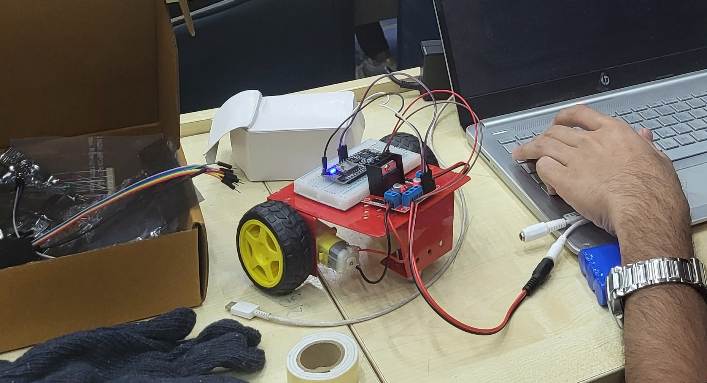

# Gesture Controlled Robot using ESP8266

## Objective
To build a robot that can be controlled wirelessly using hand gestures.
The project uses ESP8266 for communication and basic logic to control
the movement of the robot.

## System Overview
The system consists of a gesture input module, an ESP8266 microcontroller,
and a motor driver connected to DC motors.

Gesture data is transmitted wirelessly to the ESP8266.
Based on the received data, the ESP8266 processes the input
and controls the motors accordingly.

## Components Used
- ESP8266 (NodeMCU)
- DC Motors
- Motor Driver Module
- Gesture sensor / controller
- Robot chassis
- Power supply

## Working Logic
- Forward gesture → Robot moves forward
- Left / Right gesture → Robot turns accordingly
- No gesture → Robot stops

## Connections
Standard reference schematics were used for wiring the components.
Connections were verified through testing and debugging.

## Challenges and Learning
### Challenges
- Wireless connection issues during setup
- Motor direction mismatch

### Learning
- Basics of ESP8266 wireless communication
- Hardware integration
- Debugging real-time systems
  
## Demo

